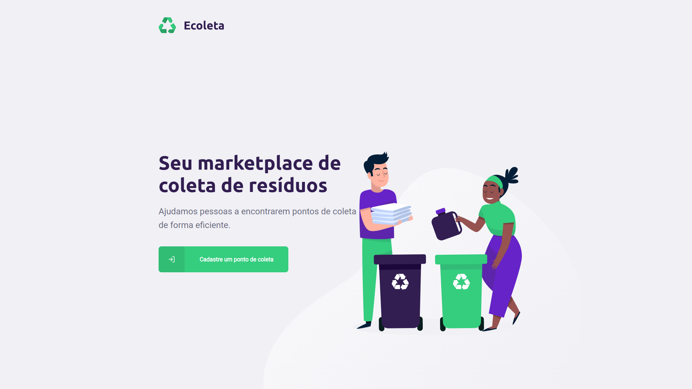

<h1 align="center">
  
<h1>
<h4 align='center'>
  Seu marketplace de coleta de resíduos
</h4>

  

<br>


## :rocket:

This project was developed at the [NEXT LEVEL WEEK](http://nextlevelweek.com/)

## Para rodar a aplicação:

1. Necessario ter o [NODE](https://nodejs.org/en/download/) e o [YARN](https://yarnpkg.com/)
1. Se quiser testar o app mobile também sera necessario instalar o expo atraves do comando
```bash
  npm install -g expo-cli
```
1. usar os seguintes comandos no terminal aplicação 
```bash
  //dentro da pasta 'server'
  yarn dev
  //dentro da pasta 'web' e 'mobile'
  yarn start
```
<br>
<h4>
Made with 💜️ by Rocketseat
</h4>
